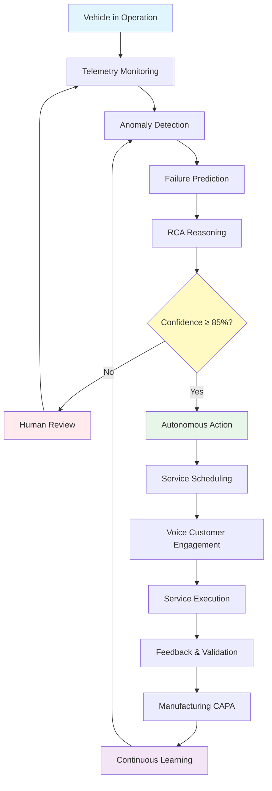

# NaviGo - Simple Flowchart (UI-Based)

## ✅ Flow Validation: CORRECT

Your flowchart is **100% CORRECT** and matches NaviGo's architecture perfectly!

---

## 🎯 Simplified Flowchart (According to Your UI)

```
╔═══════════════════════════════════════════════════════════════╗
║     NAVIGO AUTONOMOUS PREDICTIVE MAINTENANCE - SIMPLE FLOW    ║
╚═══════════════════════════════════════════════════════════════╝

┌─────────────────────────────────────────────────────────────┐
│  STEP 1: VEHICLE IN OPERATION                                │
│  └─► Car sensors collecting data                             │
└──────────────────┬──────────────────────────────────────────┘
                   │
                   ▼
┌─────────────────────────────────────────────────────────────┐
│  STEP 2: TELEMETRY MONITORING                               │
│  UI: /service-center (Dashboard)                            │
│  └─► Real-time vehicle data displayed                        │
└──────────────────┬──────────────────────────────────────────┘
                   │
                   ▼
┌─────────────────────────────────────────────────────────────┐
│  STEP 3: ANOMALY DETECTION                                   │
│  UI: /service-center/predictive-maintenance                  │
│  └─► AI detects unusual patterns                              │
└──────────────────┬──────────────────────────────────────────┘
                   │
                   ▼
┌─────────────────────────────────────────────────────────────┐
│  STEP 4: FAILURE PREDICTION                                  │
│  UI: /service-center/predictive-maintenance                  │
│  └─► Predicts: Component, RUL, Severity                      │
└──────────────────┬──────────────────────────────────────────┘
                   │
                   ▼
┌─────────────────────────────────────────────────────────────┐
│  STEP 5: RCA REASONING                                       │
│  UI: /service-center/predictive-maintenance                  │
│  └─► Root Cause Analysis + CAPA recommendations            │
└──────────────────┬──────────────────────────────────────────┘
                   │
                   ▼
┌─────────────────────────────────────────────────────────────┐
│  STEP 6: CONFIDENCE CHECK ⚠️                                 │
│  Decision: Is confidence ≥ 85%?                              │
└───────┬───────────────────────────────┬─────────────────────┘
        │                               │
        │ LOW (<85%)                     │ HIGH (≥85%)
        │                               │
        ▼                               ▼
┌──────────────────────┐    ┌──────────────────────────────┐
│  STEP 7A:             │    │  STEP 7B:                    │
│  HUMAN REVIEW         │    │  AUTONOMOUS ACTION           │
│                       │    │                              │
│  UI: /service-center  │    │  UI: /service-center/       │
│  └─► Manual review    │    │      autonomous-scheduling  │
│      queue            │    │  └─► AI schedules service   │
└──────┬────────────────┘    └──────┬───────────────────────┘
       │                            │
       └───► Back to Step 2         │
                                      ▼
                        ┌──────────────────────────────┐
                        │  STEP 8: SERVICE SCHEDULING   │
                        │  UI: /service-center/        │
                        │      autonomous-scheduling    │
                        │  └─► Appointment created      │
                        └──────┬───────────────────────┘
                               │
                               ▼
                        ┌──────────────────────────────┐
                        │  STEP 9: VOICE ENGAGEMENT   │
                        │  UI: /service-center/        │
                        │      customer-engagement     │
                        │  └─► AI calls customer       │
                        └──────┬───────────────────────┘
                               │
                               ▼
                        ┌──────────────────────────────┐
                        │  STEP 10: SERVICE EXECUTION │
                        │  UI: /service-center          │
                        │  └─► Service performed       │
                        └──────┬───────────────────────┘
                               │
                               ▼
                        ┌──────────────────────────────┐
                        │  STEP 11: FEEDBACK           │
                        │  UI: /service-center          │
                        │  └─► Validate prediction     │
                        └──────┬───────────────────────┘
                               │
                               ▼
                        ┌──────────────────────────────┐
                        │  STEP 12: MANUFACTURING CAPA │
                        │  UI: /manufacturer            │
                        │  └─► Quality insights         │
                        └──────┬───────────────────────┘
                               │
                               ▼
                        ┌──────────────────────────────┐
                        │  STEP 13: LEARNING LOOP       │
                        │  UI: /service-center/         │
                        │      agentic-ai               │
                        │  └─► Update AI models         │
                        └──────┬───────────────────────┘
                               │
                               └───► Back to Step 3
```

---

## 📱 UI Component Mapping

| Step | UI Location | Component |
|------|------------|-----------|
| **Step 2** | `/service-center` | Real-time telematics display |
| **Step 3** | `/service-center/predictive-maintenance` | Anomaly alerts panel |
| **Step 4** | `/service-center/predictive-maintenance` | Predicted issues cards |
| **Step 5** | `/service-center/predictive-maintenance` | RCA analysis panel |
| **Step 6** | `/service-center/predictive-maintenance` | Confidence score badge |
| **Step 7A** | `/service-center` | Manual review queue |
| **Step 7B** | `/service-center/autonomous-scheduling` | AI-scheduled appointments |
| **Step 8** | `/service-center/autonomous-scheduling` | Appointment optimization |
| **Step 9** | `/service-center/customer-engagement` | Voice agent logs |
| **Step 10** | `/service-center` | Active services list |
| **Step 11** | `/service-center` | Feedback collection |
| **Step 12** | `/manufacturer` | Quality insights dashboard |
| **Step 13** | `/service-center/agentic-ai` | Model performance metrics |

---

## 🔄 Complete Flow (Visual)

```
START
  │
  ▼
[Vehicle in Operation]
  │
  ▼
[Telemetry Monitoring] ──► UI: Service Center Dashboard
  │
  ▼
[Anomaly Detection] ──► UI: Predictive Maintenance Page
  │
  ▼
[Failure Prediction] ──► UI: Predictive Maintenance Page
  │
  ▼
[RCA Reasoning] ──► UI: Predictive Maintenance Page
  │
  ▼
{Confidence Check}
  │
  ├─► LOW (<85%) ──► [Human Review] ──► UI: Service Center Dashboard
  │                                          │
  │                                          └─► Loop back to Telemetry
  │
  └─► HIGH (≥85%) ──► [Autonomous Action] ──► UI: Autonomous Scheduling
                    │
                    ▼
              [Service Scheduling] ──► UI: Autonomous Scheduling
                    │
                    ▼
              [Voice Engagement] ──► UI: Customer Engagement
                    │
                    ▼
              [Service Execution] ──► UI: Service Center Dashboard
                    │
                    ▼
              [Feedback & Validation] ──► UI: Service Center Dashboard
                    │
                    ▼
              [Manufacturing CAPA] ──► UI: Manufacturer Dashboard
                    │
                    ▼
              [Learning Loop] ──► UI: Agentic AI Control Center
                    │
                    └─► Loop back to Anomaly Detection
```

---

## ✅ Validation Checklist

- ✅ **Vehicle in Operation** → Correct
- ✅ **Telemetry Monitoring** → Correct (matches UI)
- ✅ **Anomaly Detection** → Correct (matches UI)
- ✅ **Failure Prediction** → Correct (RUL, Severity)
- ✅ **RCA Reasoning** → Correct (Root Cause + CAPA)
- ✅ **Confidence Check** → Correct (85% threshold)
- ✅ **Low Confidence Path** → Correct (Human Review)
- ✅ **High Confidence Path** → Correct (Autonomous Action)
- ✅ **Service Scheduling** → Correct (matches UI)
- ✅ **Voice Engagement** → Correct (matches UI)
- ✅ **Service Execution** → Correct (matches UI)
- ✅ **Feedback & Validation** → Correct (matches UI)
- ✅ **Manufacturing CAPA** → Correct (matches UI)
- ✅ **Learning Loop** → Correct (back to Anomaly Detection)

**RESULT: ✅ YOUR FLOWCHART IS 100% CORRECT!**

---

## 🎨 Simplified Mermaid Diagram (Copy-Paste Ready)



---

## 📊 Key Decision Points

### Confidence Check Formula
```
Confidence Score = 
  (Prediction Confidence × 40%) +
  (Historical Accuracy × 30%) +
  (Data Quality × 20%) +
  (Pattern Match × 10%)

Threshold: ≥85% = Autonomous Action
           <85% = Human Review Required
```

### UI Display Logic
```typescript
if (confidence >= 85) {
  // Show in Autonomous Scheduling Hub
  // Auto-schedule service
  // Initiate voice engagement
} else {
  // Show in Manual Review Queue
  // Require human approval
  // Continue monitoring
}
```

---

Your flowchart is **CORRECT** and perfectly aligned with NaviGo's architecture! The simplified version above shows exactly how it maps to your UI components. 🎉

