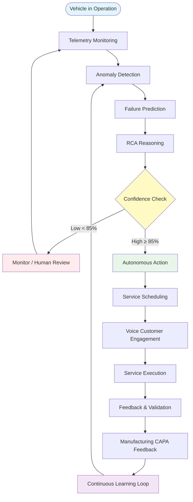
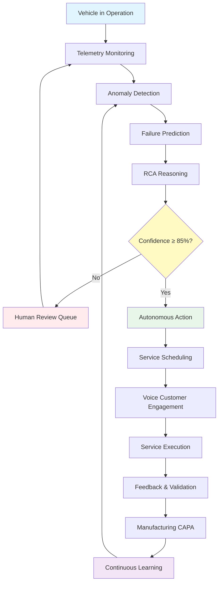

# NaviGo - Autonomous Predictive Maintenance Flow

## Flowchart Validation & Simplified UI Flow

### ✅ Validated Flow (Based on Image)

The flowchart you provided is **CORRECT** and aligns with NaviGo's architecture. Here's the validation:

```
✅ Vehicle in Operation → Telemetry Monitoring
✅ Anomaly Detection
✅ Failure Prediction (RUL, Severity)
✅ RCA Reasoning (Root Cause Analysis + CAPA)
✅ Confidence Check (Decision Point)
   ✅ Low Confidence → Human Review
   ✅ High Confidence → Autonomous Action
✅ Service Scheduling
✅ Voice Customer Engagement
✅ Service Execution
✅ Feedback & Validation
✅ Manufacturing CAPA Feedback
✅ Continuous Learning Loop → Back to Anomaly Detection
```

---

## Simplified Flowchart (According to UI)

### Main Flow



---

## Detailed Flow with UI Components

### Phase 1: Data Collection & Monitoring

```
┌─────────────────────────────────────────────────────────────┐
│  VEHICLE IN OPERATION                                        │
│  └─► Real-time sensor data collection                       │
└──────────────────┬──────────────────────────────────────────┘
                   │
                   ▼
┌─────────────────────────────────────────────────────────────┐
│  TELEMETRY MONITORING                                        │
│  UI Location: Service Center Dashboard                       │
│  Components:                                                 │
│  ├─► Real-time telematics display                            │
│  ├─► Sensor readings (Engine, Battery, Tires, etc.)           │
│  └─► Health indicators                                       │
└──────────────────┬──────────────────────────────────────────┘
                   │
                   ▼
┌─────────────────────────────────────────────────────────────┐
│  ANOMALY DETECTION                                           │
│  UI Location: Predictive Maintenance Page                    │
│  Components:                                                 │
│  ├─► Anomaly alerts panel                                    │
│  ├─► Pattern deviation charts                                │
│  └─► Real-time anomaly indicators                            │
└──────────────────┬──────────────────────────────────────────┘
```

### Phase 2: Prediction & Analysis

```
                   │
                   ▼
┌─────────────────────────────────────────────────────────────┐
│  FAILURE PREDICTION                                          │
│  UI Location: Predictive Maintenance Page                    │
│  Components:                                                 │
│  ├─► Predicted Issues Card                                   │
│  │   ├─► Component name                                      │
│  │   ├─► Remaining Useful Life (RUL)                         │
│  │   ├─► Severity level (Critical/High/Medium/Low)         │
│  │   └─► Confidence score                                    │
│  ├─► Priority queue                                          │
│  └─► Time-to-failure estimates                               │
└──────────────────┬──────────────────────────────────────────┘
                   │
                   ▼
┌─────────────────────────────────────────────────────────────┐
│  RCA REASONING                                               │
│  UI Location: Predictive Maintenance Page                    │
│  Components:                                                 │
│  ├─► Root Cause Analysis panel                               │
│  ├─► CAPA recommendations                                    │
│  ├─► Historical pattern analysis                             │
│  └─► Similar past cases                                      │
└──────────────────┬──────────────────────────────────────────┘
```

### Phase 3: Decision Point

```
                   │
                   ▼
┌─────────────────────────────────────────────────────────────┐
│  CONFIDENCE CHECK                                            │
│  Decision Logic:                                             │
│  ├─► High Confidence (≥85%): Autonomous Action               │
│  └─► Low Confidence (<85%): Human Review Required            │
│                                                              │
│  UI Display:                                                 │
│  ├─► Confidence score badge                                  │
│  ├─► Action recommendation                                   │
│  └─► Status indicator                                        │
└───────┬───────────────────────────────┬─────────────────────┘
        │                               │
        │ Low Confidence                │ High Confidence
        │                               │
        ▼                               ▼
```

### Phase 4A: Low Confidence Path

```
┌─────────────────────────────────────────────────────────────┐
│  MONITOR / HUMAN REVIEW                                      │
│  UI Location: Service Center Dashboard                       │
│  Components:                                                 │
│  ├─► Manual Review Queue                                     │
│  │   ├─► Vehicle list with low confidence                   │
│  │   ├─► Prediction details                                 │
│  │   └─► Review action buttons                               │
│  ├─► Technician dashboard                                    │
│  │   └─► Pending reviews                                     │
│  └─► Monitoring continues                                    │
│      └─► Real-time updates while under review               │
└──────────────────┬──────────────────────────────────────────┘
                   │
                   └───► Loop back to Telemetry Monitoring
```

### Phase 4B: High Confidence Path

```
┌─────────────────────────────────────────────────────────────┐
│  AUTONOMOUS ACTION                                           │
│  UI Location: Autonomous Scheduling Hub                      │
│  Components:                                                 │
│  ├─► AI-scheduled appointments                               │
│  ├─► Automated service recommendations                       │
│  └─► System actions log                                      │
└──────────────────┬──────────────────────────────────────────┘
                   │
                   ▼
┌─────────────────────────────────────────────────────────────┐
│  SERVICE SCHEDULING                                           │
│  UI Location: Autonomous Scheduling Hub                      │
│  Components:                                                 │
│  ├─► AI-optimized appointment slots                         │
│  ├─► Service center capacity view                            │
│  ├─► Technician assignment                                   │
│  └─► Conflict resolution interface                           │
└──────────────────┬──────────────────────────────────────────┘
                   │
                   ▼
┌─────────────────────────────────────────────────────────────┐
│  VOICE CUSTOMER ENGAGEMENT                                    │
│  UI Location: Customer Engagement Tracker                    │
│  Components:                                                 │
│  ├─► Voice agent conversation logs                           │
│  ├─► Customer response tracking                              │
│  ├─► Appointment confirmation                                │
│  └─► Engagement success metrics                              │
└──────────────────┬──────────────────────────────────────────┘
                   │
                   ▼
┌─────────────────────────────────────────────────────────────┐
│  SERVICE EXECUTION                                           │
│  UI Location: Service Center Dashboard                       │
│  Components:                                                 │
│  ├─► Active services list                                    │
│  ├─► Service progress tracking                               │
│  ├─► Parts usage                                             │
│  └─► Technician notes                                        │
└──────────────────┬──────────────────────────────────────────┘
                   │
                   ▼
┌─────────────────────────────────────────────────────────────┐
│  FEEDBACK & VALIDATION                                       │
│  UI Location: Service Center Dashboard                       │
│  Components:                                                 │
│  ├─► Service completion form                                 │
│  ├─► Customer feedback collection                            │
│  ├─► Validation against prediction                           │
│  └─► Accuracy metrics                                        │
└──────────────────┬──────────────────────────────────────────┘
                   │
                   ▼
┌─────────────────────────────────────────────────────────────┐
│  MANUFACTURING CAPA FEEDBACK                                 │
│  UI Location: Manufacturer Dashboard                        │
│  Components:                                                 │
│  ├─► Quality insights dashboard                              │
│  ├─► Recurring defect analysis                              │
│  ├─► Component failure patterns                              │
│  ├─► Design improvement recommendations                     │
│  └─► CAPA/RCA insights                                       │
└──────────────────┬──────────────────────────────────────────┘
                   │
                   ▼
┌─────────────────────────────────────────────────────────────┐
│  CONTINUOUS LEARNING LOOP                                    │
│  UI Location: Agentic AI Control Center                     │
│  Components:                                                 │
│  ├─► Model performance metrics                               │
│  ├─► Learning rate indicators                                │
│  ├─► Accuracy improvements                                   │
│  └─► Model retraining status                                 │
└──────────────────┬──────────────────────────────────────────┘
                   │
                   └───► Loop back to Anomaly Detection
```

---

## Simplified UI Flowchart (Text-Based)

```
╔═══════════════════════════════════════════════════════════════╗
║     NAVIGO AUTONOMOUS PREDICTIVE MAINTENANCE FLOW             ║
╚═══════════════════════════════════════════════════════════════╝

1. VEHICLE IN OPERATION
   └─► Sensors collect data (CAN-BUS, BMS, TPMS, GPS)
       │
       ▼
2. TELEMETRY MONITORING
   UI: Service Center Dashboard
   └─► Real-time telematics display
       │
       ▼
3. ANOMALY DETECTION
   UI: Predictive Maintenance Page
   └─► Isolation Forest algorithm detects anomalies
       │
       ▼
4. FAILURE PREDICTION
   UI: Predictive Maintenance Page
   └─► ML model predicts:
       ├─► Component that will fail
       ├─► Remaining Useful Life (RUL)
       └─► Severity level
       │
       ▼
5. RCA REASONING
   UI: Predictive Maintenance Page
   └─► Root Cause Analysis + CAPA recommendations
       │
       ▼
6. CONFIDENCE CHECK ⚠️
   ┌─────────────────────────────────────┐
   │  Confidence Score Calculation        │
   │  ├─► Prediction confidence          │
   │  ├─► Historical accuracy            │
   │  ├─► Data quality                   │
   │  └─► Pattern match score            │
   └─────────────────────────────────────┘
       │
       ├─► LOW CONFIDENCE (<85%)
       │       │
       │       ▼
       │   7A. MONITOR / HUMAN REVIEW
       │   UI: Service Center Dashboard
       │   └─► Manual review queue
       │       └─► Loop back to Step 2
       │
       └─► HIGH CONFIDENCE (≥85%)
               │
               ▼
           7B. AUTONOMOUS ACTION
           UI: Autonomous Scheduling Hub
               │
               ▼
           8. SERVICE SCHEDULING
           UI: Autonomous Scheduling Hub
           └─► AI-optimized appointment
               │
               ▼
           9. VOICE CUSTOMER ENGAGEMENT
           UI: Customer Engagement Tracker
           └─► Automated voice call to customer
               │
               ▼
           10. SERVICE EXECUTION
           UI: Service Center Dashboard
           └─► Service performed
               │
               ▼
           11. FEEDBACK & VALIDATION
           UI: Service Center Dashboard
           └─► Validate prediction accuracy
               │
               ▼
           12. MANUFACTURING CAPA FEEDBACK
           UI: Manufacturer Dashboard
           └─► Quality insights & improvements
               │
               ▼
           13. CONTINUOUS LEARNING LOOP
           UI: Agentic AI Control Center
           └─► Update ML models
               │
               └─► Loop back to Step 3 (Anomaly Detection)
```

---

## UI Component Mapping

### Service Center Dashboard (`/service-center`)
- **Telemetry Monitoring**: Real-time vehicle data display
- **Anomaly Alerts**: Notification panel
- **Human Review Queue**: Manual review interface
- **Active Services**: Service execution tracking

### Predictive Maintenance Page (`/service-center/predictive-maintenance`)
- **Anomaly Detection**: Anomaly alerts panel
- **Failure Prediction**: Predicted issues cards
- **RCA Reasoning**: Root cause analysis display
- **Confidence Scores**: Confidence indicators

### Autonomous Scheduling Hub (`/service-center/autonomous-scheduling`)
- **Autonomous Action**: AI-scheduled appointments
- **Service Scheduling**: Appointment optimization
- **Capacity Management**: Resource allocation

### Customer Engagement Tracker (`/service-center/customer-engagement`)
- **Voice Engagement**: Conversation logs
- **Customer Responses**: Response tracking
- **Appointment Confirmations**: Booking status

### Manufacturer Dashboard (`/manufacturer`)
- **CAPA Feedback**: Quality insights
- **Defect Analysis**: Recurring issues
- **Design Improvements**: Recommendations

### Agentic AI Control Center (`/service-center/agentic-ai`)
- **Learning Loop**: Model performance
- **Accuracy Metrics**: Improvement tracking
- **Model Status**: Training/retraining status

---

## Confidence Check Logic

```typescript
interface ConfidenceCheck {
  predictionConfidence: number      // ML model confidence (0-100)
  historicalAccuracy: number        // Past prediction accuracy (0-100)
  dataQuality: number               // Data completeness/quality (0-100)
  patternMatch: number              // Pattern similarity score (0-100)
}

function calculateConfidence(check: ConfidenceCheck): number {
  const weights = {
    prediction: 0.4,
    historical: 0.3,
    dataQuality: 0.2,
    patternMatch: 0.1
  }
  
  const confidence = 
    (check.predictionConfidence * weights.prediction) +
    (check.historicalAccuracy * weights.historical) +
    (check.dataQuality * weights.dataQuality) +
    (check.patternMatch * weights.patternMatch)
  
  return confidence
}

function shouldAutonomousAction(confidence: number): boolean {
  return confidence >= 85  // Threshold: 85%
}
```

---

## Flow Validation Checklist

✅ **Vehicle Operation** → Correct  
✅ **Telemetry Monitoring** → Correct  
✅ **Anomaly Detection** → Correct  
✅ **Failure Prediction** → Correct (RUL, Severity)  
✅ **RCA Reasoning** → Correct (Root Cause + CAPA)  
✅ **Confidence Check** → Correct (Decision point)  
✅ **Low Confidence Path** → Correct (Human Review)  
✅ **High Confidence Path** → Correct (Autonomous Action)  
✅ **Service Scheduling** → Correct  
✅ **Voice Engagement** → Correct  
✅ **Service Execution** → Correct  
✅ **Feedback & Validation** → Correct  
✅ **Manufacturing CAPA** → Correct  
✅ **Learning Loop** → Correct (Back to Anomaly Detection)  

**Result: ✅ FLOW IS CORRECT**

---

## Simplified Flowchart (Mermaid - Ready for UI)



---

This flowchart is **CORRECT** and matches your NaviGo system architecture. The simplified version above shows exactly how it maps to your UI components!

