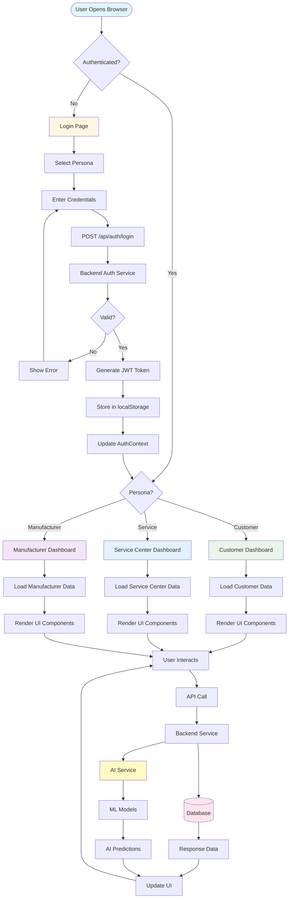
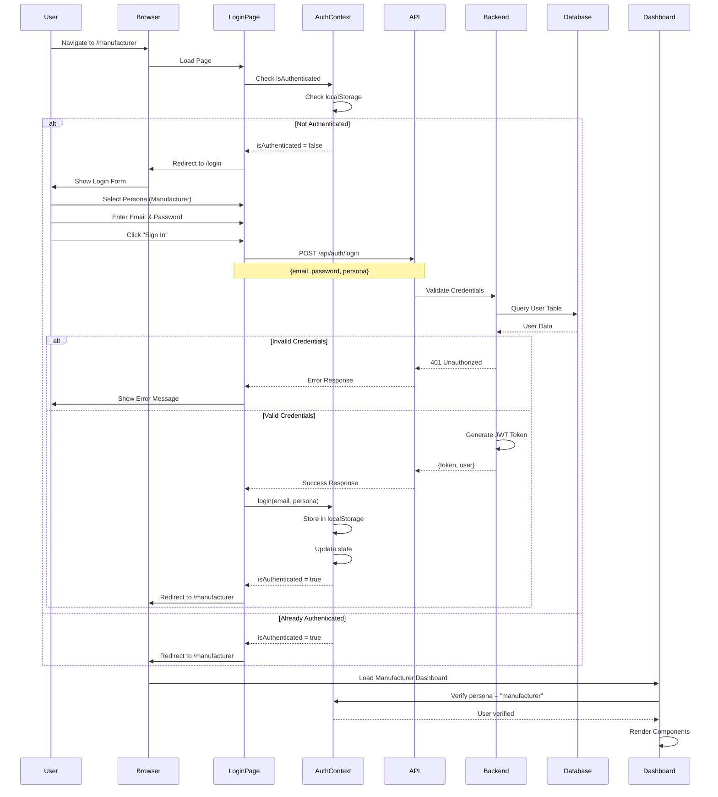
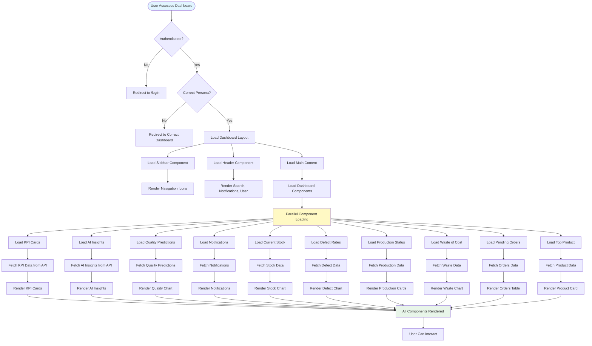
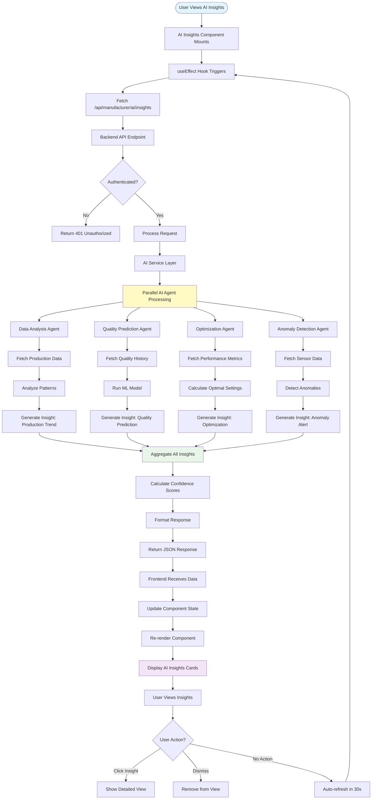
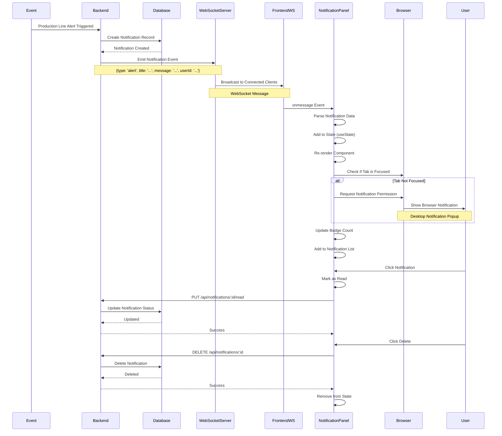
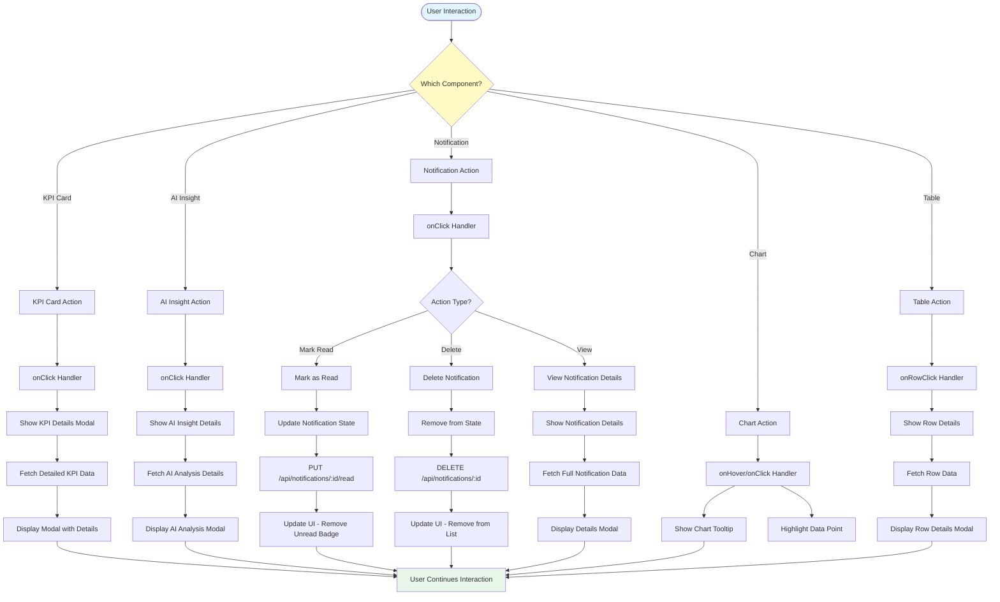
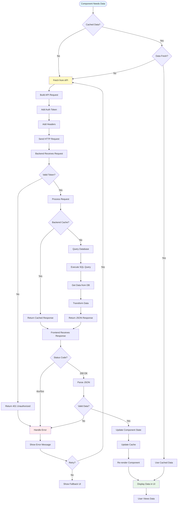
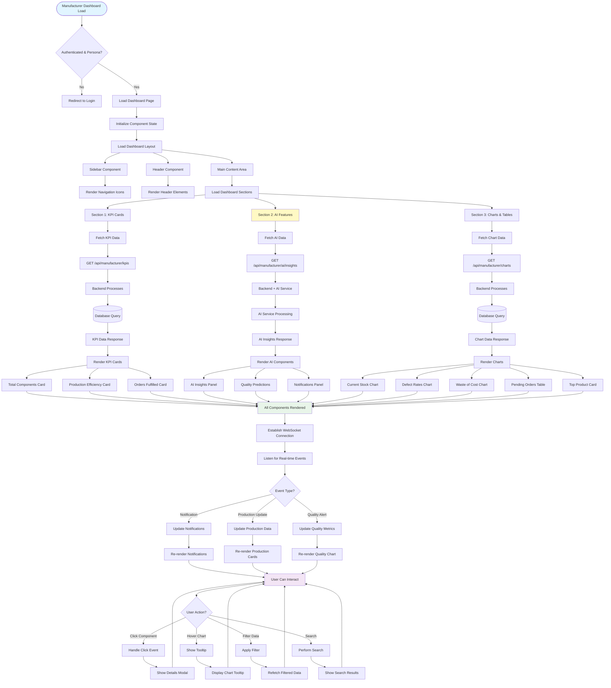

# NaviGo System - Complete Flowchart Documentation

## Table of Contents
1. [System Overview Flowchart](#1-system-overview-flowchart)
2. [User Authentication Flow](#2-user-authentication-flow)
3. [Dashboard Loading Flow](#3-dashboard-loading-flow)
4. [AI Pipeline Flow](#4-ai-pipeline-flow)
5. [Real-time Notification Flow](#5-real-time-notification-flow)
6. [Component Interaction Flow](#6-component-interaction-flow)
7. [Data Fetching Flow](#7-data-fetching-flow)
8. [Manufacturer Dashboard Flow](#8-manufacturer-dashboard-flow)

---

## 1. System Overview Flowchart



---

## 2. User Authentication Flow



---

## 3. Dashboard Loading Flow



---

## 4. AI Pipeline Flow



---

## 5. Real-time Notification Flow



---

## 6. Component Interaction Flow



---

## 7. Data Fetching Flow



---

## 8. Manufacturer Dashboard Flow



---

## Complete System Flow (ASCII Art)

```
┌─────────────────────────────────────────────────────────────────┐
│                    NAVIGO SYSTEM COMPLETE FLOW                   │
└─────────────────────────────────────────────────────────────────┘

USER BROWSER
    │
    ├─► Navigate to https://navigo.com/manufacturer
    │
    ▼
┌───────────────────────────────────────────────────────────────┐
│                    NEXT.JS APP ROUTER                          │
│  ┌─────────────────────────────────────────────────────────┐ │
│  │  Route: /manufacturer                                    │ │
│  │  └─► app/manufacturer/page.tsx                          │ │
│  └─────────────────────────────────────────────────────────┘ │
└───────────────────────────────────────────────────────────────┘
    │
    ├─► Check Authentication (AuthContext)
    │       │
    │       ├─► Check localStorage for token
    │       │
    │       └─► If not authenticated → Redirect to /login
    │
    ▼
┌───────────────────────────────────────────────────────────────┐
│              MANUFACTURER DASHBOARD PAGE                       │
│  ┌─────────────────────────────────────────────────────────┐ │
│  │  useEffect Hook Triggers                                 │ │
│  │  ├─► Verify persona === "manufacturer"                 │ │
│  │  └─► If not → Redirect to correct dashboard             │ │
│  └─────────────────────────────────────────────────────────┘ │
└───────────────────────────────────────────────────────────────┘
    │
    ├─► Render Layout Components
    │       │
    │       ├─► ManufacturerSidebar
    │       │       └─► Navigation Icons
    │       │
    │       ├─► ManufacturerHeader
    │       │       ├─► Search Bar
    │       │       ├─► Notifications Icon
    │       │       └─► User Profile
    │       │
    │       └─► Main Content Area
    │
    ▼
┌───────────────────────────────────────────────────────────────┐
│              DASHBOARD COMPONENTS LOADING                      │
│  ┌──────────────┐  ┌──────────────┐  ┌──────────────┐       │
│  │  KPI Cards   │  │  AI Features │  │  Charts      │       │
│  │              │  │              │  │              │       │
│  │  useEffect   │  │  useEffect   │  │  useEffect   │       │
│  │  └─► Fetch   │  │  └─► Fetch   │  │  └─► Fetch   │       │
│  └──────┬───────┘  └──────┬───────┘  └──────┬───────┘       │
│         │                 │                  │                │
│         └─────────────────┴──────────────────┘               │
│                          │                                    │
│                          ▼                                    │
│              ┌─────────────────────────┐                      │
│              │   API CALLS (Parallel)  │                      │
│              └─────────────────────────┘                      │
└───────────────────────────────────────────────────────────────┘
    │
    ├─► GET /api/manufacturer/kpis
    ├─► GET /api/manufacturer/ai/insights
    ├─► GET /api/manufacturer/quality/predictions
    ├─► GET /api/manufacturer/notifications
    ├─► GET /api/manufacturer/stock
    ├─► GET /api/manufacturer/defects
    ├─► GET /api/manufacturer/production
    ├─► GET /api/manufacturer/waste
    ├─► GET /api/manufacturer/orders
    └─► GET /api/manufacturer/top-product
    │
    ▼
┌───────────────────────────────────────────────────────────────┐
│                    BACKEND API LAYER                           │
│  ┌─────────────────────────────────────────────────────────┐ │
│  │  1. Validate JWT Token                                   │ │
│  │  2. Check Authorization (persona = manufacturer)         │ │
│  │  3. Process Request                                      │ │
│  └─────────────────────────────────────────────────────────┘ │
└───────────────────────────────────────────────────────────────┘
    │
    ├─► Route to Appropriate Service
    │       │
    │       ├─► Data Service (for KPIs, Stock, etc.)
    │       │       │
    │       │       └─► Query Database
    │       │               │
    │       │               └─► PostgreSQL
    │       │                       │
    │       │                       └─► Return Data
    │       │
    │       └─► AI Service (for AI Insights, Predictions)
    │               │
    │               ├─► Data Analysis Agent
    │               │       │
    │               │       └─► Analyze Production Data
    │               │
    │               ├─► Quality Prediction Agent
    │               │       │
    │               │       └─► Run ML Model
    │               │               │
    │               │               └─► Generate Prediction
    │               │
    │               └─► Optimization Agent
    │                       │
    │                       └─► Calculate Optimizations
    │
    ▼
┌───────────────────────────────────────────────────────────────┐
│                    RESPONSE DATA                               │
│  ┌─────────────────────────────────────────────────────────┐ │
│  │  JSON Response:                                         │ │
│  │  {                                                      │ │
│  │    "kpis": {...},                                      │ │
│  │    "aiInsights": [...],                                │ │
│  │    "qualityPrediction": {...},                         │ │
│  │    "notifications": [...],                              │ │
│  │    ...                                                 │ │
│  │  }                                                     │ │
│  └─────────────────────────────────────────────────────────┘ │
└───────────────────────────────────────────────────────────────┘
    │
    ▼
┌───────────────────────────────────────────────────────────────┐
│              FRONTEND COMPONENT UPDATES                        │
│  ┌─────────────────────────────────────────────────────────┐ │
│  │  1. Update Component State (useState)                   │ │
│  │  2. Trigger Re-render                                    │ │
│  │  3. Display Data in UI                                   │ │
│  └─────────────────────────────────────────────────────────┘ │
└───────────────────────────────────────────────────────────────┘
    │
    ├─► KPI Cards Display Metrics
    ├─► AI Insights Show Predictions
    ├─► Charts Render with Data
    ├─► Tables Populate with Rows
    └─► Notifications Show Alerts
    │
    ▼
┌───────────────────────────────────────────────────────────────┐
│              REAL-TIME UPDATES (WebSocket)                     │
│  ┌─────────────────────────────────────────────────────────┐ │
│  │  WebSocket Connection Established                       │ │
│  │  └─► wss://api.navigo.com/notifications                 │ │
│  │                                                          │ │
│  │  Listen for Events:                                     │ │
│  │  ├─► Production Line Alert                              │ │
│  │  ├─► Quality Check Complete                            │ │
│  │  ├─► New Order Received                                 │ │
│  │  └─► Inventory Low Alert                                │ │
│  │                                                          │ │
│  │  On Event:                                              │ │
│  │  1. Update Notification State                           │ │
│  │  2. Show Browser Notification (if tab not focused)     │ │
│  │  3. Update Badge Count                                  │ │
│  │  4. Add to Notification List                            │ │
│  └─────────────────────────────────────────────────────────┘ │
└───────────────────────────────────────────────────────────────┘
    │
    ▼
┌───────────────────────────────────────────────────────────────┐
│                    USER INTERACTIONS                          │
│  ┌─────────────────────────────────────────────────────────┐ │
│  │  User can:                                               │ │
│  │  ├─► Click on Cards → Show Details                      │ │
│  │  ├─► Hover on Charts → Show Tooltips                    │ │
│  │  ├─► Filter Notifications → Update List                 │ │
│  │  ├─► Mark Notifications as Read                         │ │
│  │  ├─► Search for Data                                    │ │
│  │  └─► Navigate to Other Pages                            │ │
│  └─────────────────────────────────────────────────────────┘ │
└───────────────────────────────────────────────────────────────┘
    │
    └─► Loop Continues (Auto-refresh, Real-time Updates)
```

---

## Key Flow Points

### 1. **Authentication Flow**
- User must authenticate before accessing dashboard
- JWT token stored in localStorage/sessionStorage
- Token validated on every API request
- Persona-based routing ensures correct dashboard

### 2. **Data Fetching Flow**
- Components fetch data independently using useEffect
- Parallel API calls for better performance
- Caching strategy to reduce API calls
- Error handling with fallback UI

### 3. **AI Pipeline Flow**
- AI Service processes requests asynchronously
- Multiple AI agents work in parallel
- ML models generate predictions
- Confidence scores included in responses

### 4. **Real-time Flow**
- WebSocket connection for live updates
- Event-driven architecture
- Browser notifications for important alerts
- State updates trigger UI re-renders

### 5. **Component Lifecycle**
- Mount → Fetch Data → Render → Update → Unmount
- useEffect hooks manage side effects
- State updates trigger re-renders
- Cleanup functions prevent memory leaks

---

## Performance Optimizations

1. **Parallel Data Fetching**: All API calls happen simultaneously
2. **Code Splitting**: Components loaded on demand
3. **Memoization**: Expensive calculations cached
4. **Virtual Scrolling**: Large lists rendered efficiently
5. **Debouncing**: Search inputs debounced
6. **Request Deduplication**: Duplicate requests prevented

---

## Error Handling Flow

```
API Request
    │
    ├─► Network Error?
    │       └─► Show "Connection Error" → Retry Button
    │
    ├─► 401 Unauthorized?
    │       └─► Clear Auth → Redirect to Login
    │
    ├─► 403 Forbidden?
    │       └─► Show "Access Denied" Message
    │
    ├─► 500 Server Error?
    │       └─► Show "Server Error" → Retry Button
    │
    └─► Success?
            └─► Update State → Render Data
```

---

This comprehensive flowchart documentation provides a complete view of how the NaviGo system works from user interaction to backend processing to AI pipeline and back to the frontend display.

